# webdev-blog

Автор: Белкин Никита Евгеньевич
Группа: ИСП-9.20

practice

Краткое описание:
Блог-платформа для разработчиков, где можно публиковать статьи, добавлять теги, комментировать и управлять контентом через удобный интерфейс

В архитектуре выбрал вариант "А". 
обоснование: 
- Гибкость
- Близость с реальной работой
- Фронтенд и бекенд не мешают друг другу

Технологии
Фронтенд:
- Next.js 15
- TypeScript 
- Tailwind CSS

Бекенд:
- Express.js
- TypeScript
- Prisma ORM
- SQLite 
- JWT
- bcryptjs

Запуск.
Нужно:
- Node.js 18+
- npm

Клонирование репозитория GitHub
git clone https://github.com/nikitabelkin0001-blip/webdev-blog.git
cd webdev-blog

Запуск бекенда:
cd backend
npm install
copy .env.example .env   или создайте .env вручную
npx prisma migrate dev --name init
npx prisma db seed
npm run dev

запустится на http://localhost:4000

Запуск фронтенда:
cd frontend
npm install
npm run dev

запустится на http://localhost:3000

API Эндпоинты:
GET /api/tags – получить все теги
Ответ:
[
  { "id": 1, "name": "JavaScript" },
  { "id": 2, "name": "React" }
]

POST /api/tags – создать тег
Тело:
{ "name": "TypeScript" }

Ответ:
{ "id": 3, "name": "TypeScript" }

GET /api/posts – получить все посты
Ответ:
[
  {
    "id": 1,
    "title": "Введение в Next.js",
    "content": "Содержание статьи...",
    "slug": "vvedenie-v-nextjs",
    "createdAt": "2026-06-10T12:00:00Z",
    "authorId": 1,
    "tags": [{ "id": 1, "name": "JavaScript" }]
  }
]

GET /api/posts/:id – получить пост по id
Ответ:
{
  "id": 1,
  "title": "Введение в Next.js",
  "content": "Next.js — это React-фреймворк для создания серверных и статических приложений...",
  "slug": "vvedenie-v-nextjs",
  "authorId": 1,
  "author": {
    "id": 1,
    "name": "Иван Иванов",
    "email": "ivan@example.com"
  },
  "tags": [
    { "id": 1, "name": "JavaScript" },
    { "id": 2, "name": "React" }
  ],
  "createdAt": "2026-06-10T12:00:00.000Z",
  "updatedAt": "2026-06-10T14:30:00.000Z"
}

Ошибка 404 – пост не найден:
{ "error": "Post not found" }

POST /api/posts – cоздать пост
Тело:
{
  "title": "Новый пост",
  "content": "Содержание статьи...",
  "slug": "novyy-post",
  "tagIds": [1, 2]
}

Ответ:
{
  "id": 2,
  "title": "Новый пост",
  "slug": "novyy-post",
  "authorId": 1,
  "createdAt": "2026-06-10T15:00:00.000Z"
}

PUT /api/posts/:id – обновить пост
Тело:
{
  "title": "Обновлённое название",
  "content": "Обновлённое содержание"
}

Ответ:
{
  "id": 1,
  "title": "Обновлённое название",
  "content": "Обновлённое содержание",
  "slug": "vvedenie-v-nextjs",
  "updatedAt": "2026-06-10T16:00:00.000Z"
}

DELETE /api/posts/:id – удалить пост
Ответ:
204 No Content

POST /api/auth/register – Регистрация
Тело:
{
  "email": "user@example.com",
  "password": "password123",
  "name": "Иван Иванов"
}

Ответ: 
{
  "id": 1,
  "email": "user@example.com",
  "name": "Иван Иванов",
  "token": "eyJhbGciOiJIUzI1NiIsInR5cCI6IkpXVCJ9..."
}

POST /api/auth/login – вход
Тело:
{
  "email": "user@example.com",
  "password": "password123"
}

Ответ:
{
  "id": 1,
  "email": "user@example.com",
  "name": "Иван Иванов",
  "token": "eyJhbGciOiJIUzI1NiIsInR5cCI6IkpXVCJ9..."
}

GET /api/auth/me – получить текущего пользователя
Ответ:
{
  "id": 1,
  "email": "user@example.com",
  "name": "Иван Иванов"
}

Ошибка 401 – не авторизован:
{ "error": "Unauthorized" }

Структура базы данных:
Таблица User:
id --- int
email --- string
password --- string
name --- string
createdAt --- datetime

Таблица Post:
id --- int
title --- string
content --- string
slug -- string
authorId --- int
createAt --- datetime
updateAt --- datetime

Таблица Tag:
id --- int
name --- string

Таблица PostTag:
postId --- int
tagId --- int
post --- post
tag --- tag

Связи:
User-Post    один ко многим 
Post-PostTag   один ко многим
Tag-PostTag    один ко многим
Post-Tag     многие ко многим

скриншоты:
Шапка:
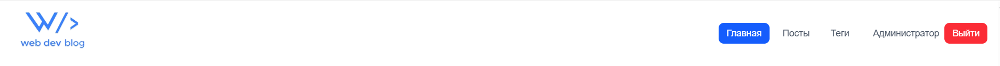

Подвал:

Главная страница:
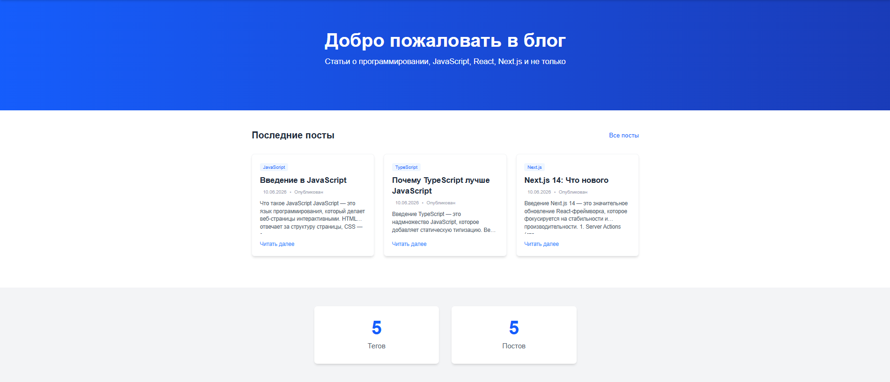

Страница с постами:
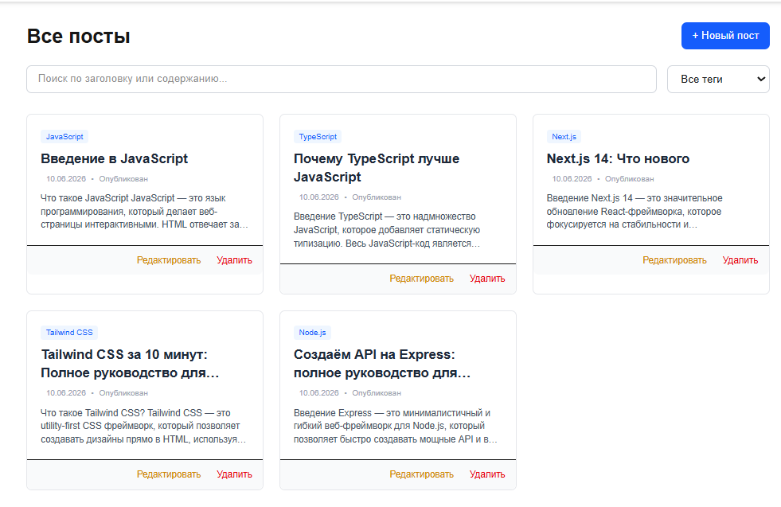

Создание поста:
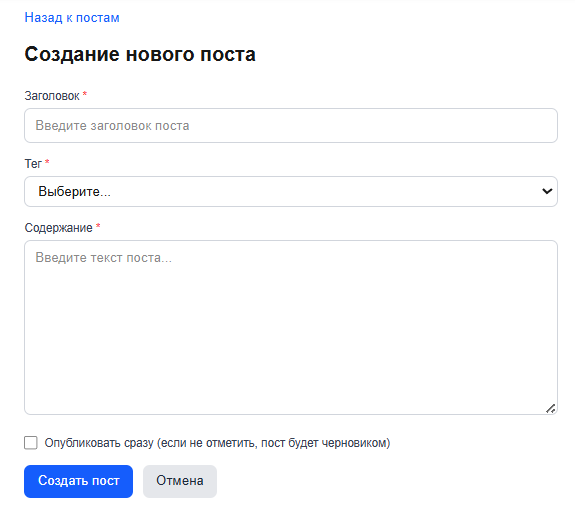

Просмотр поста:
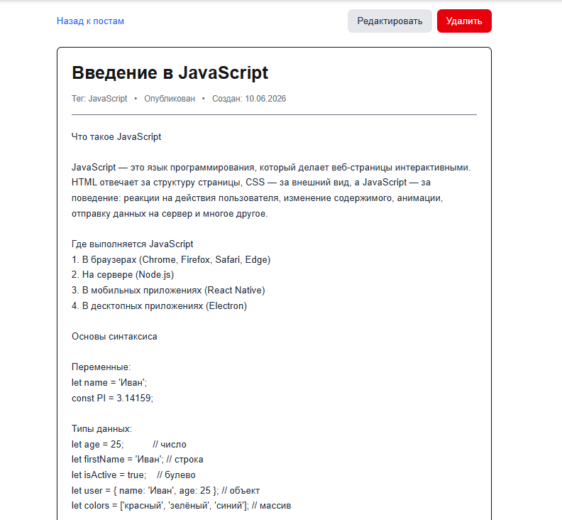

Редактирование поста:
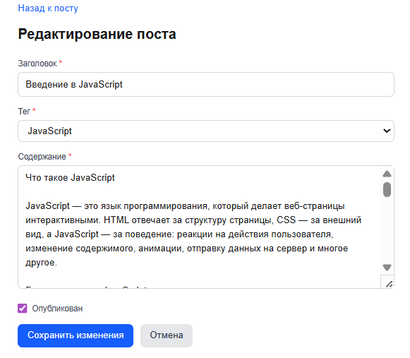

Удаление поста:
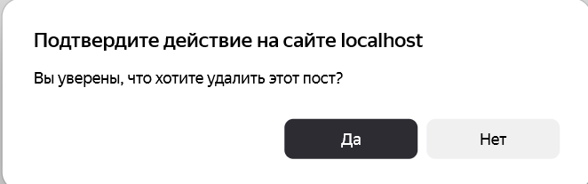
тег удаляется также

Страница тегов:
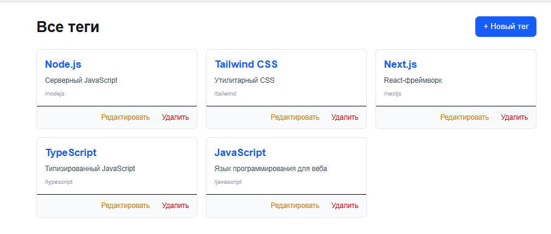

Просмотр тега:
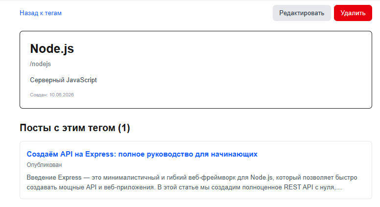

Редактирование тега:
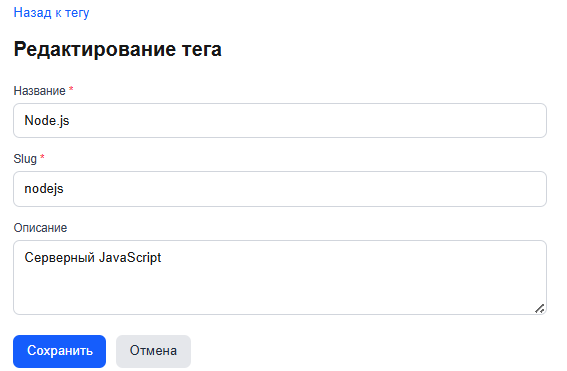

Создание тега:
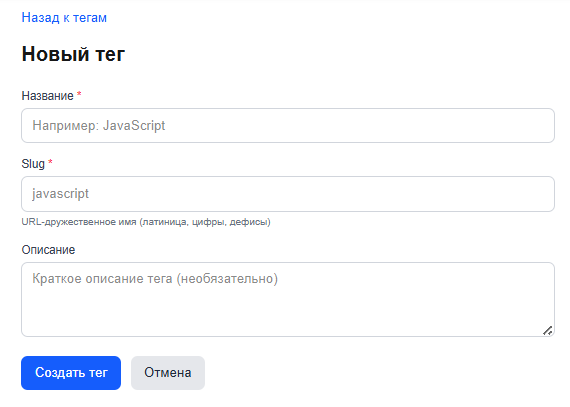

Авторизация:
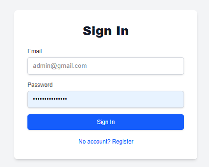

Регистрация:
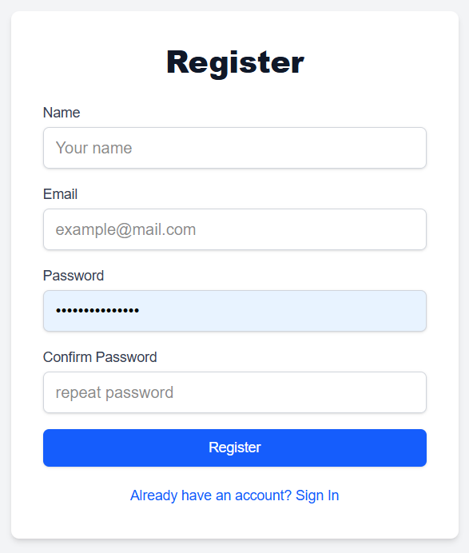

Ошибка: Cannot find module './router'
cd backend
rmdir /s /q node_modules
del package-lock.json
npm install
npm run dev
